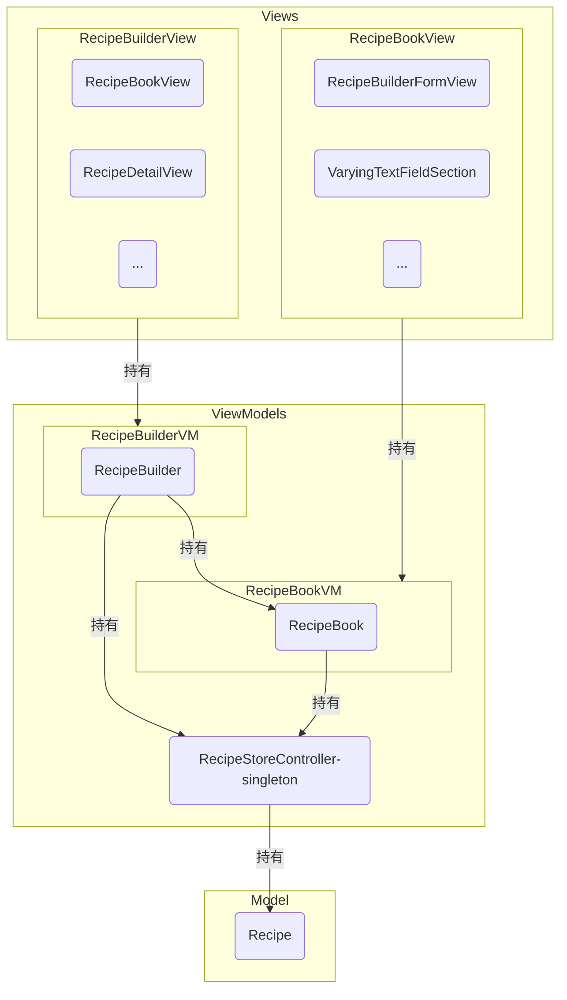
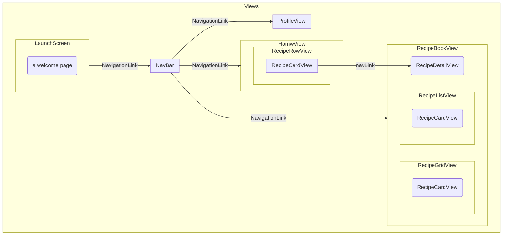

# RecipeBank: 面向烹饪爱好者的食谱记录平台

目录

[TOC]

## 预览九宫格

|  |  |  |
| ------------------------------------------------------------ | ------------------------------------------------------------ | ------------------------------------------------------------ |
|  |  |  |
|  |  |  |


## 需求简介和初步设计

### 思路来源和基本需求

在App Store上以“食谱”为关键词搜索，能得到各种大同小异的菜谱软件，此类App大多跟各种菜谱网站的形式类似，用户搜索某种食材或菜肴的名字，并得到具体的食谱。与此同时，随着短视频形式的流媒体平台的兴起，相似的内容更为流行。在此背景下，越来越多人的烹饪水平有所提升，烹饪不仅仅是满足需求层次理论中最低一级的生理需求，更是为了满足自我实现的需求——此时，现有的食谱App往往难以满足这些需求。

以笔者本人为例，在烹饪的过程中，经常会遇到这些问题，而后就会想——要是有下面一款App就好了...需求如下：

- 食谱来源广泛——来自现成食谱、朋友分享、网络视频等，需要以一种统一的格式记录下来。同时，对炒菜、炖菜、红烧、卤水、糖水、中式面点、西式面点等不同食谱，有不同的模式，这里可以引入食谱**模板**的概念，用不同的模板来记录不同种类的食谱。
- 现有的食谱制作出来的效果不一定好，这是因为食材不同导致（如，不同品牌的面粉因为蛋白质含量不同，会对包子、面包等食物成品有较大影响）。很多时候需要对食谱进行修改。
- 有时候，自己自创的一些食谱会有出奇好的效果，这时如果疏于记录，往往后面很难复现。希望能有快速记录的模式。
- 对面点等需要配方比例精准的食谱，希望能够自动计算配方的比例。比如说，某食谱用600g面粉，400g水，5g酵母等等 和成某面团，而我手头只剩400g面粉，这时希望能按比例自动计算出其他各种配料的用量。
- 出于对需求层次理论中最高一级——自我实现需求的满足，很多时候希望对成品进行记录，比如成品图片、视频等。很多时候只是拍摄到手机相册中，查找不便。同时，希望能将食谱以优美的形式导出，以分享给伙伴。

### 功能

- **初步功能概述：**

  - 用户可以进行食谱记录：利用提供的默认模板，快速记录下某种食谱的配料和简要制作步骤。

  - 用户可以自己创建新的食谱模板，并使用自建的模板记录和改进食谱。

  - 用户可以很方便的对食谱进行改进，同时支持保存食谱的历史版本，以便用户研究不同食谱细节对成品的影响。

  - 用户可以对面点等需要配方比例精准的食谱，自动计算其配方比例。比如说，某食谱用600g面粉，400g水，5g酵母等等 和成某面团，而我手头只剩400g面粉，用户能按比例自动计算出其他各种配料的用量。

  - 用户可以保存食谱的成品图片，导出食谱、分享食谱。

- **最终实现功能**：

  - 首先，经过对现有类似软件的调研，笔者发现一些食谱软件的涉及分组、分块等复杂但不一定实用的功能，为使用和开发造成了不必要的麻烦——这会导致在记录食谱的时候需要进行的操作过多，影响记录食谱的速度，同时，缺乏食谱模版等提升复用性的功能。因此本项目主要的novelty所在就是希望能通过食谱模版等，快速记录下某种食谱的配料和简要制作步骤。

  - **食谱模版的实现思考**：食谱模版存在的意义在于方便用户快速增加某一类新的食谱。而任意一个食谱，主要都可以分为**配料（ingredients）**和**步骤（instructions）**两部分。食谱模版不会改变食谱由配料和步骤组成的这一事实，更多的是实现这样一个功能：比如说包子，有素包子、肉包子、生肉包、酱肉包等等，但是他们除了馅不同之外，包子皮的配料和步骤是类似的。如果我每新增一个包子食谱，都要重新记录一遍包子皮的制作流程，那就太浪费时间了；但是如果吧包子皮跟包子馅分开成两个食谱，每做一次包子都要在两个食谱之间来回切换，更不方便。

    因此，如果在我新增一个包子食谱的时候，能导入已有的包子面皮的配料和步骤，就方便很多了。因此，这里引入**元食谱（metaRecipe）**的概念：元食谱是食谱的食谱，食谱可以引用元食谱。酱肉包是一种食谱，包子皮就是元食谱。当然，包子皮可以是广式的甜口包子皮，也可以是北方的呛面包子皮，更可以是万能面团（一种可用于包子、花卷、饼的万能面团）：因此，用户可以定义各种各样的**元食谱**，并在食谱中引用他们。

- **UI页面规划**：

  - 欢迎页面。
  - 主页面：提供食谱的分组预览功能，支持快速查找食谱。
    - 食谱画廊页面：提供食谱分类画廊视角，方便浏览和查找。
    - 食谱细节页面：提供快速、简洁、美观的食谱细节预览。

  - 食谱管理页面：可以用来管理食谱和元食谱。可以对食谱与元食谱进行增删改查的操作。
    - 食谱编辑页面：可以对现成的食谱进行编辑（改进）。对应需求中：很多时候需要对食谱进行修改 这一条。
    - 新建食谱页面：这个页面用来新建任意食谱。支持对食谱的名称、描述（食谱的口味等）、配料、步骤、评论（用来记录注意事项、探索不同做法的效果 - 对应需求中历史效果记录着一层、等等），进行增删改的操作。其中，还可以对食材进行分组，对食材和步骤调整顺序等。与此同时，可以**导入元食谱（或对元食谱进行修改）**，方便快速记录。

### 优劣势

- 优点：应用场景真实，笔者本人就希望能够使用这样一款App；实现可行——不像其他需要服务端的平台，现阶段不需要考虑服务端的开发，作为个人项目更为现实，且有更多时间能够细化UI细节、提升用户体验。
- 需要注意：要区分该应用与一般的记事本应用的区别。这可以通过强调食谱模板等功能实现。


## 技术栈

- Swift 5
- SwiftUI 2：用于UI设计。
- Core Data：用于本地的数据持久化保存。
- UIKit View Controllers：用于支持相机拍摄，从相册中选择相片作为菜谱封面。


## 架构

将从数据模型、数据管理、视图结构三个方面展开。

### 数据模型

出于简便，将食谱与元食谱和为一个表。这样整个数据模型只有一个表 **Recipes**。

| 属性 | 名称         | 描述                   | 数据类型 | 数据宽度 | 小数位数 | 单位 | 值约束                | 允许空值否 | 值个数 |
| ---- | ------------ | ---------------------- | -------- | -------- | -------- | ---- | --------------------- | ---------- | ------ |
| 1    | name         | 食谱（或元食谱）名称   | String   | /        | 0        | 无   | /                     | 否         | 1      |
| 2    | description  | 食谱描述               | String   | /        | 0        | 无   | /                     | 否         | 1      |
| 3    | metaRecipe   | 该食谱持有的元食谱     | Recipe   | /        | 0        | 无   | /                     | 是         | 1      |
| 4    | ingredients  | 食谱的配料             | [String] | /        | 0        | 无   | 长度与amounts相同     | 否         | 1      |
| 5    | amounts      | 每种配料的用量         | [String] | /        | 0        | 无   | 长度与ingredients相同 | 否         | 1      |
| 6    | comments     | 评论（可以是经验总结） | [String] | /        | 0        | 无   | /                     | 是         | 1      |
| 7    | image        | 食谱图片               | Data     | /        | 0        | 无   | 是Image               | 是         | 1      |
| 8    | isMeta       | 是否为元食谱           | Bool     | /        | 0        | 无   | $\in \{0,1\}$         | 否         | 1      |
| 9    | id           | id                     | UUID     | /        | 0        | 无   | UUID                  | 否         | 1      |
| 10   | instructions | 步骤                   | [String] | /        | /        | /    | /                     | 否         | 1      |


### 数据管理

本项目采用了`swiftUI + mvvm`模式。大致架构如下：



- Model：前面已经介绍。

- **ViewModel**：

  - 如上图所示，按照预览页面粉类RecipeBookView和RecipeBuilderView分为RecipeBookVM和RecipeBuilderVM：分别持有存储管理类RecipeStoreController，分别用来当作预览查看（以及导航页面）和编辑新增菜谱页面的ViewModel。

  - **RecipeStoreController**：

    应用了单例模式，持有 NSPersistentContainer 对象，用于直接管理 coreData 数据，如下所示提供了增加、改、删、查等接口。

    ```go
    import CoreData
    import SwiftUI
    
    class RecipeStoreController {
        static let instance = RecipeStoreController("RecipeBuilderModel")
        let container: NSPersistentContainer
        
        init(_ name: String) {
            container = NSPersistentCloudKitContainer(name: name)
            container.loadPersistentStores { (description, error) in
                
                if error != nil {
                    print("Failed to load persistent stores from CloudKit container for data model: \(name) : \(error!.localizedDescription)")
                    return
                }
            }
            container.viewContext.automaticallyMergesChangesFromParent = true
            container.viewContext.mergePolicy = NSMergeByPropertyObjectTrumpMergePolicy
        }
        
        func add(name: String, ingredients: [String], amounts: [String], instructions: [String], image: Data?, describe: String, comments: [String]) {
            
        }
        
        func edit(id: UUID, name: String, ingredients: [String], amounts: [String], instructions: [String], image: Data?, describe: String, comments: [String]) {
            
        }
        
        func get(with id: UUID) -> Recipe? {
            
        }
        
        func fetchRecipes() -> [Recipe]? {
    
        }
        
        func fetchSortedRecipes(sortDescriptors: [NSSortDescriptor] =  [NSSortDescriptor(keyPath: \Recipe.name, ascending: true)]) -> [Recipe]? {
    
        }
        
        func delete(at offsets: IndexSet) {
    
        }
    }
    
    ```

  - **RecipeBook**

    用于导航和预览页面，包含刷新，删除等方法。

    ```go
    import SwiftUI
    import CoreData
    
    /// The RecipeBook is the view model that represents all the recipes a user has,
    /// it communicates with the PersistenceController to load these recipes
    class RecipeBook: ObservableObject {
        @Published var recipes: [Recipe]? = [] // checked in UI for error
        private let controller = RecipeStoreController.instance
        
        init() {
            refresh()
        }
        
        func refresh() {
            recipes = controller.fetchSortedRecipes()
        }
        
        func delete(at offsets: IndexSet) {
            controller.delete(at: offsets)
            refresh()
        }
    }
    ```

    

  - **RecipeBuilder**

    用于食谱编辑新增页面，提供导入元食谱，增删保存的方法。

    ```go
    class RecipeBuilder: ObservableObject {
        private var book: RecipeBook
        @Published var name: String = ""
        @Published var ingredients: [String] = [""]
        @Published var amounts: [String] = [""]
        @Published var instructions: [String] = [""]
        @Published var comments: [String] = [""]
        @Published var describe: String = ""
        @Published var image: Data? = nil
        private var controller = RecipeStoreController.instance
        private var recipe: Recipe?
        
        init(recipe: Recipe? = nil, book: RecipeBook) {
            self.recipe = recipe
            self.book = book
            setRecipe(recipe)
        }
        
        func getBook() -> RecipeBook {
            return self.book
        }
        
        func save() {
            //...
        }
        
        func setRecipe(_ recipe: Recipe?) {
            //...
        }
    }
    
    ```

- View：将在后面介绍。

  

### 视图架构



每个视图的具体功能会在接下来的实现功能简介部分说明。


## 功能设计与实现

- 用户进入app后进过用户欢迎页进入导航页，可以前往预览页，食谱元、食谱后构建页和设置页。用户欢迎页和导航页效果：

|  |  |
| ------------------------------------------------------------ | ------------------------------------------------------------ |


- **食谱画廊和食谱细节预览**：Home页面就是食谱画廊页，可以展示Favorite食谱，后续可以扩展展示不同分类的食谱等。

|  |  |  |
| ------------------------------------------------------------ | ------------------------------------------------------------ | ------------------------------------------------------------ |


- **食谱管理页面**：一个用于增、删、改进食谱的导航页面，提供Grid和List两种模式，点击食谱后进入食谱预览页，可以查看食谱并编辑食谱。点击新增食谱，或者点击某一个食谱的编辑按钮，都会转到食谱编辑页面，这一页面将在后一节介绍。

|  |  |  |  |
| ------------------------------------------------------------ | ------------------------------------------------------------ | ------------------------------------------------------------ | ------------------------------------------------------------ |


- **食谱编辑，食谱新增页**：用来编辑和新增食谱。在具体的页面中，可以分组，调换顺序，增删改不同的配料、步骤、评论，还可以导入元食谱，还可以导入相片。

| 编辑现有食谱                                                 | 增删改功能俱全，可以调换顺序                                 | 新增新的食谱，可以导入元食谱                                 |
| ------------------------------------------------------------ | ------------------------------------------------------------ | ------------------------------------------------------------ |
|  |  |  |

| 食谱出现空项会提示                                           | 食谱可以导入相册                                             | 相册预览                                                     |
| ------------------------------------------------------------ | ------------------------------------------------------------ | ------------------------------------------------------------ |
|  |  |  |


